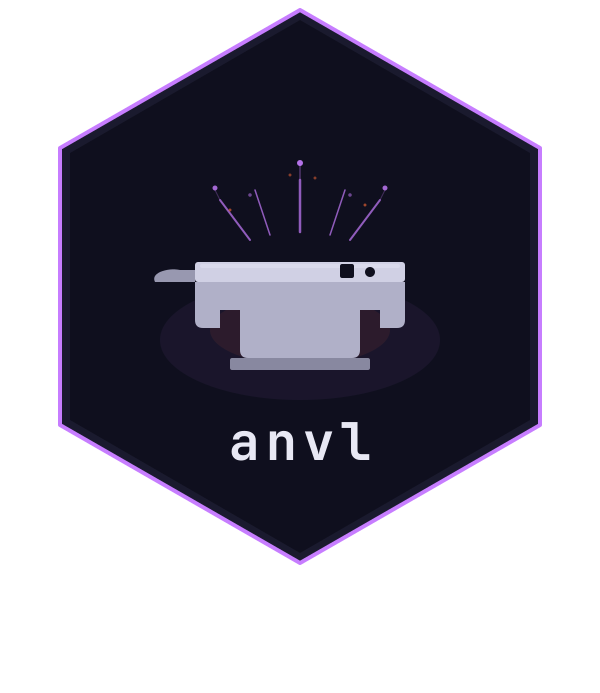

<!-- README.md is generated from README.Rmd. Please edit that file -->

# anvl 

Package website: [release](https://r-xla.github.io/anvl/) \|
[dev](https://r-xla.github.io/anvl/dev/)

<!-- badges: start -->


[](https://CRAN.R-project.org/package=anvl)
[](https://codecov.io/gh/r-xla/anvl)
[](https://r-xla.r-universe.dev/anvl)

<!-- badges: end -->

Accelerated array computing and code transformations for R, allowing you
to run numerical programs at the speed of light. The package supports
JIT compilation for very fast execution and reverse-mode automatic
differentiation. Programs can run on CPU and NVIDIA GPU.

## Installation

``` r
install.packages("anvl", repos = c("https://r-xla.r-universe.dev", getOption("repos")))
```

Install CUDA support on linux amd64:

``` r
install.packages("cuda12.8", repos = "https://mlverse.r-universe.dev")
```

See the [Installation
guide](https://r-xla.github.io/anvl/articles/installation.html) for more
details, including prebuilt Docker images.

## Why anvl

anvl makes numerical R code run fast on CPUs and GPUs, and computes
gradients of your functions automatically. It aspires to be for R what
JAX is for Python.

There are three ideas:

- **Compilation.** {anvl} converts R functions into an optimized program
  via XLA – the same compiler that powers JAX and TensorFlow. Due to the
  compilation, resulting programs can be faster compared to implementing
  them in [{torch}](https://torch.mlverse.org).
- **Function transformation.** Programmatically derive new functions
  from existing ones. Currently the only available transformation is
  reverse-mode automatic differentiation via `gradient()`, which returns
  the derivative of a function as another R function.
- **Hardware portability.** The same code runs on CPU or GPU.
- **Extensible.** The package is written almost entirely in R; new
  primitives and transformations can be added without leaving R.

## Usage

We define an R function operating on `AnvlArray`s – the primary data
type of {anvl}. It can be executed in either *eager* mode (each
operation is performed immediately) or *jit* mode (the whole function is
compiled into a single executable via `jit()`).

``` r
library(anvl)
f <- function(a, b, x) {
  a * x + b
}

a <- nv_scalar(1.0, "f32")
b <- nv_scalar(-2.0, "f32")
x <- nv_scalar(3.0, "f32")

# Eager mode
f(a, b, x)
#> AnvlArray
#>  1
#> [ CPUf32{} ]

# JIT mode
f_jit <- jit(f)
f_jit(a, b, x)
#> AnvlArray
#>  1
#> [ CPUf32{} ]
```

Through automatic differentiation, we can also obtain the gradient of
the above function.

``` r
g_jit <- jit(gradient(f, wrt = c("a", "b")))
g_jit(a, b, x)
#> $a
#> AnvlArray
#>  3
#> [ CPUf32{} ] 
#> 
#> $b
#> AnvlArray
#>  1
#> [ CPUf32{} ]
```

For more complex examples, such as implementing a Gaussian Process, see
the package website.

## Platform Support

| Platform              | CPU |        GPU         |
|-----------------------|:---:|:------------------:|
| Linux (x86_64)        |  ✓  |       ✓ CUDA       |
| Linux (ARM)           |  ✓  |         ✗          |
| Windows               |  ✓  | ◐ WSL2 only (CUDA) |
| macOS (Apple Silicon) |  ✓  |         ✗          |
| macOS (Intel)         |  ✗  |         ✗          |

✓ fully supported  ·  ◐ limited support  ·  ✗ not supported

## Acknowledgments

- This work is supported by [MaRDI](https://www.mardi4nfdi.de).
- The design of this package was inspired by and borrows from:
  - JAX, especially the [autodidax
    tutorial](https://docs.jax.dev/en/latest/autodidax.html).
  - The [microjax](https://github.com/joey00072/microjax) project.
- For JIT compilation, we leverage the [OpenXLA](https://openxla.org/)
  project.
