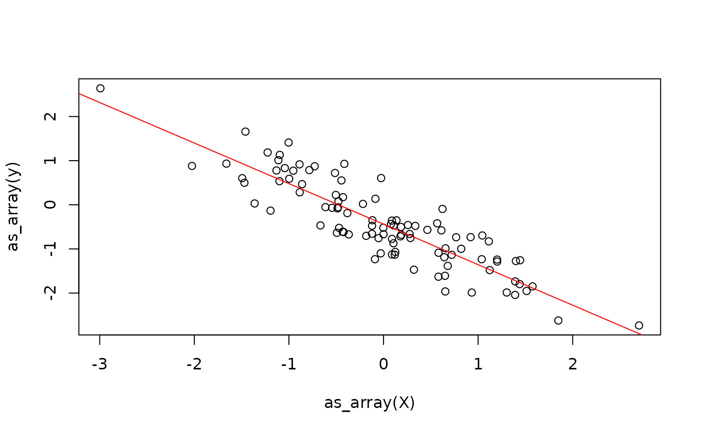

# Get Started

In this vignette, you will learn everything you need to know to get
started implementing numerical algorithms using {anvil}. If you have
experience with JAX in Python, you should feel right at home.

## The `AnvilTensor`

We will start by introducing the main data structure, which is the
`AnvilTensor`. It is essentially like an `R` array, with some
differences:

1.  It supports more data types, such as different precisions, as well
    as unsigned integers.
2.  The tensor can live on different *platforms*, such as CPU or GPU.
3.  0-dimensional tensors can be used to represent scalars.

We can create such an object from R data types using the `nv_tensor` and
related functions. Below, we create a 0-dimensional tensor (i.e., a
scalar) of type `int16` on the CPU.

``` r
library(anvil)
set.seed(42)
nv_tensor(1L, dtype = "i16", device = "cpu", shape = integer())
```

    ## AnvilTensor 
    ##  1
    ## [ CPUi16{} ]

Note that for the creation of scalars, you can also use `nv_scalar` as a
shorthand to skip specifying the shape.

``` r
nv_scalar(1L, dtype = "i16", device = "cpu")
```

    ## AnvilTensor 
    ##  1
    ## [ CPUi16{} ]

We can also create higher-dimensional tensors, for example a 2x3 CPU
tensor of type `f32`. Below, we omit specifying the platform and data
type, as it will default to `"cpu"` and `"f32"`. Note that the default
data type depends on the input data type.

``` r
x <- array(1:6, dim = c(2, 3))
nv_tensor(x)
```

    ## AnvilTensor 
    ##  1 3 5
    ##  2 4 6
    ## [ CPUi32{2x3} ]

``` r
y <- nv_tensor(x, dtype = "f32")
y
```

    ## AnvilTensor 
    ##  1.0000 3.0000 5.0000
    ##  2.0000 4.0000 6.0000
    ## [ CPUf32{2x3} ]

In order to convert an `AnvilTensor` back to a regular R array, you can
use the
[`as_array()`](https://r-xla.github.io/tengen/reference/as_array.html)
function.

``` r
as_array(y)
```

    ##      [,1] [,2] [,3]
    ## [1,]    1    3    5
    ## [2,]    2    4    6

At first, working with `AnvilTensor`s may feel a bit cumbersome, because
you cannot directly apply functions to them like you would with regular
R arrays.

``` r
x + x
```

    ##      [,1] [,2] [,3]
    ## [1,]    2    6   10
    ## [2,]    4    8   12

``` r
y + y
```

    ## Error in `.current_descriptor()`:
    ## ! No graph is currently being built

## JIT Compilation

In order to work with `AnvilTensor`s, you need to convert the function
you want to apply to a jit-compiled version via
[`anvil::jit()`](../reference/jit.md).

``` r
plus_jit <- jit(`+`)
plus_jit(y, y)
```

    ## AnvilTensor 
    ##   2.0000  6.0000 10.0000
    ##   4.0000  8.0000 12.0000
    ## [ CPUf32{2x3} ]

The result of the operation is again an `AnvilTensor`.

We can, of course, jit-compile more complex functions as well.

Below, we define a function that takes in a data matrix `X`, a weight
vector `beta`, and a scalar bias `alpha`, and computes the linear model
output \\y = X \times \beta + \alpha\\.

``` r
linear_model_r <- function(X, beta, alpha) {
  X %*% beta + alpha
}

linear_model <- jit(linear_model_r)

X <- nv_tensor(rnorm(6), dtype = "f32", shape = c(2, 3))
beta <- nv_tensor(rnorm(3), dtype = "f32", shape = c(3, 1))
alpha <- nv_scalar(rnorm(1), dtype = "f32")

linear_model(X, beta, alpha)
```

    ## AnvilTensor 
    ##   2.7911
    ##  -1.1904
    ## [ CPUf32{2x1} ]

One current restriction of {anvil} is that the function has to be
re-compiled for every unique combination of input shapes, data types,
and platforms.

To demonstrate this, we create a slightly modified version of
`linear_model`.

``` r
linear_model2 <- jit(function(X, beta, alpha) {
  cat("compiling ...\n")
  X %*% beta + alpha
})
```

Next, we create a little helper function that creates example input data
with different numbers of observations:

``` r
simul_data <- function(n, p) {
  list(
    X = nv_tensor(rnorm(n * p), dtype = "f32", shape = c(n, p)),
    beta = nv_tensor(rnorm(p), dtype = "f32", shape = c(p, 1)),
    alpha = nv_scalar(rnorm(1), dtype = "f32")
  )
}
```

Below, we call the function twice on data with the same shapes.

``` r
do.call(linear_model2, simul_data(2, 3))
```

    ## compiling ...

    ## AnvilTensor 
    ##   4.9640
    ##  -0.1413
    ## [ CPUf32{2x1} ]

``` r
do.call(linear_model2, simul_data(2, 3))
```

    ## AnvilTensor 
    ##   0.6140
    ##  -2.5214
    ## [ CPUf32{2x1} ]

We can notice that we only see the `"compiling ..."` message the first
and third time. This is because the first time, the function is compiled
into an `XLA` executable and cached for later reuse. The second time, we
don’t execute the R function at all, but directly run the cached `XLA`
executable. This executable does not contain “standard” R code, like the
[`cat()`](https://rdrr.io/r/base/cat.html) call, but records only the
operations applied to `AnvilTensor`s.

If we now call the function on data with different shapes, we see that
the function is re-compiled.

``` r
y_hat <- do.call(linear_model2, simul_data(4, 3))
```

    ## compiling ...

Because the compilation step itself can take some time, {anvil}
therefore gives the best results when the same function is called many
times with the same input shapes, data types, and platforms, or the
computation itself is sufficiently large to amortize the compilation
overhead. One common application scenario where this assumption holds is
iterative optimization algorithms.

### Static Arguments

One feature of {anvil} is that not all arguments of `jit`-compiled
functions need to be `AnvilTensor`s. For example, we might want a linear
model with or without an intercept term. To do so, we add the logical
argument `with_bias` to our function. We need to mark this argument as
`static`, so {anvil} knows to treat it as a regular R value instead of
an `AnvilTensor`.

``` r
linear_model3 <- jit(function(X, beta, alpha = NULL, with_bias) {
  if (with_bias) {
    cat("Compiling without bias ...\n")
    X %*% beta + alpha
  } else {
    cat("Compiling with bias ...\n")
    X %*% beta
  }
}, static = "with_bias")
```

We can now call this function with or without a bias term:

``` r
linear_model3(X, beta, with_bias = FALSE)
```

    ## Compiling with bias ...

    ## AnvilTensor 
    ##   2.8538
    ##  -1.1277
    ## [ CPUf32{2x1} ]

``` r
linear_model3(X, beta, alpha, with_bias = TRUE)
```

    ## Compiling without bias ...

    ## AnvilTensor 
    ##   2.7911
    ##  -1.1904
    ## [ CPUf32{2x1} ]

Static arguments work differently than `AnvilTensors` as the function
will not be re-compiled for each new observed value of the static
argument.

### Nested Inputs and Outputs

Static arguments work differently than `AnvilTensors`, as the function
will not be re-compiled for each new observed value of the static
argument.

Note also that the inputs, as well as the outputs, can also contain
nested data structures that contain `AnvilTensor`s, although we
currently only support (named) lists.

``` r
linear_model4 <- jit(function(inputs) {
  list(y_hat = inputs[[1]] %*% inputs[[2]] + inputs[[3]])
})
linear_model4(list(X, beta, alpha))
```

    ## $y_hat
    ## AnvilTensor 
    ##   2.7911
    ##  -1.1904
    ## [ CPUf32{2x1} ]

So far, we have only implemented the prediction step for a linear model.
One of the core applications of anvil is to implement learning
algorithms, for which we often need gradients, as well as control flow.
We will start with gradients.

## Automatic Differentiation

In anvil, you can easily obtain the gradient function of a scalar-valued
function using [`gradient()`](../reference/gradient.md). Currently,
vector-valued functions cannot be differentiated. Below, we implement
the loss function for our linear model.

``` r
mse <- function(y_hat, y) {
  mean((y_hat - y)^nv_scalar(2.0))
}
```

We now need some target variables `y`, so we simulate some data from a
linear model:

``` r
beta <- rnorm(1)
X <- matrix(rnorm(100), ncol = 1)
alpha <- rnorm(1)
y <- X %*% beta + alpha + rnorm(100, sd = 0.5)
plot(X, y)
```


``` r
X <- nv_tensor(X)
y <- nv_tensor(y)
```

Next, we randomly initialize the model parameters:

``` r
beta_hat <- nv_tensor(rnorm(1), shape = c(1, 1), dtype = "f32")
alpha_hat <- nv_scalar(rnorm(1), dtype = "f32")
```

We can now define a function that does the prediction and calculates the
loss. Note that we are calling into the original R function that does
the prediction and not its jit-compiled version.

``` r
model_loss <- function(X, beta, alpha, y) {
  y_hat <- linear_model_r(X, beta, alpha)
  mse(y_hat, y)
}
```

Using the [`gradient()`](../reference/gradient.md) transformation, we
can automatically obtain the gradient function of `model_loss` with
respect to some of its arguments, which we specify.

``` r
model_loss_grad <- gradient(
  model_loss,
  wrt = c("beta", "alpha")
)
```

Finally, we define the update step for the weights using gradient
descent.

``` r
update_weights_r <- function(X, beta, alpha, y) {
  lr <- nv_scalar(0.1)
  grads <- model_loss_grad(X, beta, alpha, y)
  beta_new <- beta - lr * grads$beta
  alpha_new <- alpha - lr * grads$alpha
  list(beta = beta_new, alpha = alpha_new)
}
update_weights <- jit(update_weights_r)
```

This already allows us to train our linear model using gradient descent:

``` r
weights <- list(beta = beta_hat, alpha = alpha_hat)
for (i in 1:100) {
  weights <- update_weights(X, weights$beta, weights$alpha, y)
}
```



While this might seem like a reasonable solution, it continuously
switches between the R interpreter and the XLA runtime. Moreover, we
allocate new tensors in each iteration for the weights. While the latter
might not be a big problem for small models, it can lead to significant
overhead when working with bigger tensors.

Next, we will address immutability in anvil before we briefly discuss
control flow.

## Control Flow

Earlier, we have already used R control flow to train our linear model.
In principle, there are three ways to implement control-flow in anvil:

1.  Embed jit-compiled functions inside R control-flow constructs, which
    we have seen earlier.
2.  Embed R control flow inside a jit-compiled function (we have also
    seen this earlier when our linear model allowed to optionally
    include a bias term).
3.  Use special control-flow primitives provided by anvil, such as
    [`nv_while()`](../reference/nv_while.md) and
    [`nv_if()`](../reference/nv_if.md).

Which solution is best depends on the specific scenario, so we will
cover all three cases, at the risk of being a bit repetitive.

#### Training Loops

We will now revisit our linear model training example from earlier and
implement the training loop using the three different control flow
approaches.

The first implementation is what we have already seen earlier: we
jit-compile the update step and then repeatedly call it in an R loop:

``` r
n_steps <- 100L
beta_hat <- nv_tensor(rnorm(1), shape = c(1, 1), dtype = "f32")
alpha_hat <- nv_scalar(rnorm(1), dtype = "f32")

weights <- list(beta = beta_hat, alpha = alpha_hat)
for (i in seq_len(n_steps)) {
  weights <- update_weights(X, weights$beta, weights$alpha, y)
}
weights
```

    ## $beta
    ## AnvilTensor 
    ##  -0.9184
    ## [ CPUf32{1x1} ] 
    ## 
    ## $alpha
    ## AnvilTensor 
    ##  -0.4376
    ## [ CPUf32{} ]

For simple update steps, this solution can be inefficient because every
call into a jit-compiled function has some overhead. How important this
overhead is depends on how expensive each call in the loop is – for
large models, the overhead becomes negligible.

The second approach is to use an R loop within the jit-compiled
function. There, the loop will be unrolled during the compilation step.
This will be extremely slow in the example at hand, because we will also
re-compute the gradient in each iteration. The parameter `n_steps` is
static, which means that for every unique value of `n_steps`, the
function will be re-compiled into a different executable.

``` r
train_unrolled <- jit(function(X, beta, alpha, y, n_steps) {
  lr <- nv_scalar(0.1)
  for (i in seq_len(n_steps)) {
    grads <- model_loss_grad(X, beta, alpha, y)
    beta <- beta - lr * grads$beta
    alpha <- alpha - lr * grads$alpha
  }
  list(beta = beta, alpha = alpha)
}, static = "n_steps")

beta_hat <- nv_tensor(rnorm(1), shape = c(1, 1), dtype = "f32")
alpha_hat <- nv_scalar(rnorm(1), dtype = "f32")
train_unrolled(X, beta_hat, alpha_hat, y, n_steps = 10L)
```

    ## $beta
    ## AnvilTensor 
    ##  -0.9600
    ## [ CPUf32{1x1} ] 
    ## 
    ## $alpha
    ## AnvilTensor 
    ##  -0.3703
    ## [ CPUf32{} ]

Finally, the third approach is to use the `nv_while` function. It is not
like the standard while loop, because `anvil` is purely functional.

The function takes in: 1. An initial state, which is a (nested) list of
`AnvilTensor`s. 2. A `cond` function, which takes as input the current
state and returns a boolean tensor indicating whether to continue the
loop. 3. A `body` function, which takes as input the current state and
returns a new state

``` r
train_while <- jit(function(X, beta, alpha, y, n_steps) {
  lr <- nv_scalar(0.1)
  nv_while(
    list(beta = beta, alpha = alpha, i = nv_scalar(0L)),
    \(beta, alpha, i) i < n_steps,
    \(beta, alpha, i) {
      grads <- model_loss_grad(X, beta, alpha, y)
      list(
        beta = beta - lr * grads$beta,
        alpha = alpha - lr * grads$alpha,
        i = i + nv_scalar(1L)
      )
    }
  )
})

beta_hat <- nv_tensor(rnorm(1), shape = c(1, 1), dtype = "f32")
alpha_hat <- nv_scalar(rnorm(1), dtype = "f32")
train_while(X, beta_hat, alpha_hat, y, nv_scalar(100L))
```

    ## $beta
    ## AnvilTensor 
    ##  -0.9184
    ## [ CPUf32{1x1} ] 
    ## 
    ## $alpha
    ## AnvilTensor 
    ##  -0.4376
    ## [ CPUf32{} ] 
    ## 
    ## $i
    ## AnvilTensor 
    ##  100
    ## [ CPUi32{} ]

The same approach works analogously for `if`-statements, where the
{anvil} primitive `nv_if` is available.

## Immutability

`AnvilTensor` objects are immutable, i.e., once created, their value
cannot be changed. In other words, there are conceptually no in-place
updates like `x[1] <- x[1] + 1`. In other words, {anvil} follows **value
semantics**, or functions are **pure**. This means every function in
{anvil} is a pure function, i.e., it does not have any side effects and
always returns new values. Naturally, this raises the question of how
this impacts performance. We need to distinguish two scenarios: 1.
Updating an `AnvilTensor` living in `R` through a jit-compiled
function. 1. Updating an `AnvilTensor` that “lives within” a
jit-compiled function.

For the first scenario, there is nothing to worry about. The XLA
compiler is able to optimize this, ensuring that no unnecessary copies
are actually made. This is similar to copy-on-write semantics in R. If
you do `x <- 1:10; y <- x`, you are conceptually creating a copy of `x`
when assigning it to `y`, but internally, this is optimized away and the
copy will only be created once modifying `y` or `x`. Because {anvil}
uses compilation, it can make many more such optimizations, minimizing
unnecessary copies where possible.

However, there is also the case where one calls into an {anvil} function
from `R` code like in the example below:

``` r
weights <- update_weights(X, weights$beta, weights$alpha, y)
```

Because the assignment of the outputs of the {anvil} function to `R`
variables does not happen within jit-compiled code, the XLA compiler
cannot optimize this. If we know that some of the inputs to the {anvil}
function are not used anymore after the function call, we can mark them
as “donatable” when jit-compiling.

``` r
update_weights_donatable <- jit(update_weights_r, donate = c("beta", "alpha"))
```

This will tell the XLA compiler that we no longer need `alpha` and
`beta` after the function call, so their underlying memory can be
reused.

``` r
weights_out <- update_weights_donatable(X, weights$beta, weights$alpha, y)
```

If we now print the input weights, we get an error because the tensors
have been deleted.

``` r
weights
```

    ## $beta
    ## AnvilTensor

    ## Error: CopyToHostAsync() called on deleted or donated buffer

But the new weights are still there.

``` r
weights_out
```

    ## $beta
    ## AnvilTensor 
    ##  -0.9184
    ## [ CPUf32{1x1} ] 
    ## 
    ## $alpha
    ## AnvilTensor 
    ##  -0.4376
    ## [ CPUf32{} ]
