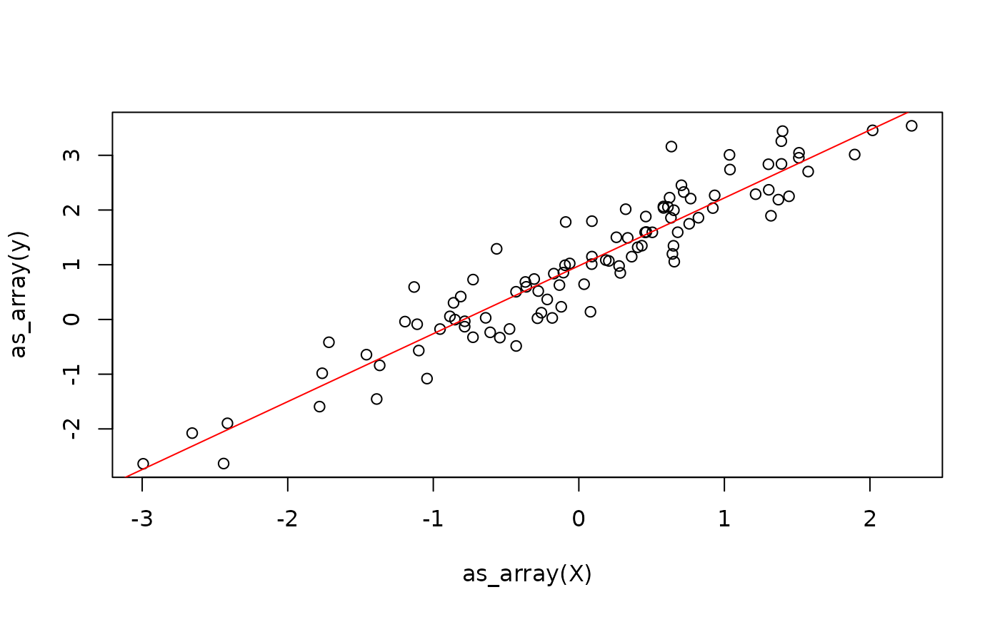

# Get Started

In this vignette, you will learn everything you need to know to get
started implementing numerical algorithms using {anvl}. If you have
experience with JAX in Python, you should feel right at home.

## The `AnvlArray`

We will start by introducing the main data structure, which is the
`AnvlArray`. It is essentially like an R array, with some differences:

1.  It supports more data types, such as different precisions or
    unsigned integers.
2.  The array is managed by a specific backend (which we will ignore for
    now) and can live on different *device*s, such as CPU (aka host) or
    a GPU.
3.  0-dimensional arrays can be used to represent scalars.

We can create an `AnvlArray` from R objects using
[`nv_array()`](https://r-xla.github.io/anvl/dev/reference/AnvlArray.md).
Below, we create a 0-dimensional array (i.e., a scalar) that holds a
16-bit integer living on the CPU.

``` r
library(anvl)
set.seed(42)
nv_array(1L, dtype = "i16", device = "cpu", shape = integer())
```

    ## AnvlArray
    ##  1
    ## [ CPUi16{} ]

Note that for the creation of scalars, you can also use
[`nv_scalar()`](https://r-xla.github.io/anvl/dev/reference/AnvlArray.md)
as a shorthand to skip specifying the shape and omit specifying the
device, as CPU is the default.

``` r
x <- nv_scalar(1L, dtype = "i16")
x
```

    ## AnvlArray
    ##  1
    ## [ CPUi16{} ]

We can also create higher-dimensional arrays, for example a `2x3` array
with single-precision floating-point numbers. Without specifying the
data type, it will default to `"f32"` for R doubles, `"i32"` for
integers, and `"bool"` for logicals.

``` r
y <- nv_array(1:6, shape = c(2, 3))
y
```

    ## AnvlArray
    ##  1 3 5
    ##  2 4 6
    ## [ CPUi32{2,3} ]

You can extract the object’s properties using getter methods.

``` r
dtype(y)
```

    ## <i32>

``` r
shape(y) # or dim()
```

    ## [1] 2 3

``` r
device(y)
```

    ## <CpuDevice(id=0)>

`AnvlArray`s have value semantics and are (with an exception we cover
later) never modified in-place.

``` r
y2 <- y
y2[1, 1] <- 99L
y2[1, 1]
```

    ## AnvlArray
    ##  99
    ## [ CPUi32{} ]

``` r
y[1, 1]
```

    ## AnvlArray
    ##  1
    ## [ CPUi32{} ]

Note that such subset assignment always copies – unlike plain R, where
`y[i] <- val` can be done in place when `y` has only one reference. This
only applies to *eager* execution. Inside a jit-compiled function
(covered later), the compiler can optimize reallocations away, similar
to R’s copy-on-write.

The
[`as_array()`](https://r-xla.github.io/anvl/dev/reference/as_array.md)
function allows to convert `AnvlArray`s back to R objects, which
involves copying the data. Note that for 0-dimensional arrays, the
result is an R vector of length 1, as R arrays cannot have 0 dimensions.

``` r
as_array(y)
```

    ##      [,1] [,2] [,3]
    ## [1,]    1    3    5
    ## [2,]    2    4    6

`AnvlArray`s can also be saved to disk and loaded back via
[`nv_save()`](https://r-xla.github.io/anvl/dev/reference/nv_save.md) /
[`nv_read()`](https://r-xla.github.io/anvl/dev/reference/nv_read.md),
which use the
[safetensors](https://huggingface.co/docs/safetensors/index) format – a
simple, cross-framework standard also used by e.g. PyTorch and JAX:

``` r
path <- tempfile(fileext = ".safetensors")
nv_save(list(x = x, y = y), path)

loaded <- nv_read(path)
loaded$x
```

    ## AnvlArray
    ##  1
    ## [ CPUi16{} ]

## Transforming AnvlArrays

There are two categories of functions in {anvl} that can be used to
transform arrays:

1.  Anvl primitives, that follow the naming scheme `prim_<op>`. They
    define the fundamental operations that can be expressed in {anvl}.
    These functions are rather low-level and often lack some ergonomics
    such as type promotion or broadcasting. Most users will not require
    to use them; for an overview see
    [`vignette("primitives")`](https://r-xla.github.io/anvl/dev/articles/primitives.md),
    and for how to add one see
    [`vignette("extending_primitive")`](https://r-xla.github.io/anvl/dev/articles/extending_primitive.md).
2.  The main User API (`nv_<op>` functions) and the overloaded R
    operators that dispatch to them. They are built on top of the
    primitives and either add convenience or higher-level functionality.

``` r
prim_add(y, y)
```

    ## AnvlArray
    ##   2  6 10
    ##   4  8 12
    ## [ CPUi32{2,3} ]

``` r
prim_add(y, x)
```

    ## Error in `prim_add()`:
    ## ! `lhs` and `rhs` must have the same tensor type.
    ## ✖ Got tensor<2x3xi32> and tensor<i16>.

``` r
nv_add(y, x)
```

    ## AnvlArray
    ##  2 4 6
    ##  3 5 7
    ## [ CPUi32{2,3} ]

Next we define a function that computes the output of a linear model \\y
= X \beta + \alpha\\, generate some example data and call the function.
We could have also used the overloaded `%*%` and `+` operators, but
chose the underlying `nv_*` function for clarity.

``` r
linear_model_r <- function(X, beta, alpha) {
  y0 <- nv_matmul(X, beta)
  nv_add(y0, alpha)
}
```

We simulate some training data from a univariate linear model and
randomly initialize some parameters that we’ll fit later.

``` r
X <- matrix(rnorm(100), ncol = 1)
beta_true <- rnorm(1)
alpha_true <- rnorm(1)
y <- X %*% beta_true + alpha_true + rnorm(100, sd = 0.5)
plot(X, y)
```


``` r
X <- nv_array(X, dtype = "f32")
y <- nv_array(y, dtype = "f32")

beta <- nv_array(rnorm(1), shape = c(1, 1), dtype = "f32")
alpha <- nv_scalar(rnorm(1), dtype = "f32")

y_hat0 <- linear_model_r(X[1:2, ], beta, alpha)
y_hat0
```

    ## AnvlArray
    ##  3.6654
    ##  1.3981
    ## [ CPUf32{2,1} ]

What we have done in this section is commonly referred to as *eager
execution*. To understand what this means, we need to differentiate it
from *JIT compilation*, which is the primary goal of {anvl} and which we
will cover next.

## Just In Time Compilation

JIT stands for *just-in-time* compilation: instead of compiling the
function ahead of time, {anvl} waits until the first call (when the
input shapes and dtypes are known) and only then translates the function
into a single optimized executable, which is cached for subsequent
calls.

To get the most out of {anvl} in terms of performance, one should
usually [`jit()`](https://r-xla.github.io/anvl/dev/reference/jit.md)
your functions. For example, we can jit-compile the `linear_model_r`
function we defined earlier. The output is a function with the same
signature that produces the same results:

``` r
linear_model <- jit(linear_model_r)
y_hat1 <- linear_model(X[1:2, ], beta, alpha)
all(y_hat0 == y_hat1)
```

    ## AnvlArray
    ##  1
    ## [ CPUbool{} ]

The difference from eager mode is that
[`jit()`](https://r-xla.github.io/anvl/dev/reference/jit.md) compiles
the whole function using [XLA](https://openxla.org/xla), which is the
same compiler that underpins frameworks like TensorFlow and JAX. The
output is an executable program that runs independently of the R
interpreter. Note that under the hood, each `prim_*` function is itself
a [`jit()`](https://r-xla.github.io/anvl/dev/reference/jit.md)-compiled
function.

One central assumption about programs that are
[`jit()`](https://r-xla.github.io/anvl/dev/reference/jit.md)-compiled is
that the R function is a *pure* function, so do not rely on side effects
such as manipulation of global state within such a function. See the
[Tracing
Contract](https://r-xla.github.io/anvl/dev/articles/jit.html#the-tracing-contract)
section of the JIT deep dive for a more thorough explanation.

At the jit boundary, plain R values are transparently converted to
`AnvlArray`s, so you don’t need to wrap every input in
[`nv_array()`](https://r-xla.github.io/anvl/dev/reference/AnvlArray.md)
yourself. This applies to both `nv_*` calls and your own
[`jit()`](https://r-xla.github.io/anvl/dev/reference/jit.md)-compiled
functions:

``` r
nv_add(1, array(2:3))
```

    ## AnvlArray
    ##  3
    ##  4
    ## [ CPUf32?{2} ]

Note the `?` after the dtype in the printed output (`f32?`): it marks
the dtype as *ambiguous*. A dtype is ambiguous when it was inferred from
an auto-converted R value rather than pinned by the user (e.g. via
`nv_array(..., dtype = "f32")`), so the type-promotion rules are allowed
to coerce it more freely when combining it with a non-ambiguous operand.
See
[`vignette("type-promotion")`](https://r-xla.github.io/anvl/dev/articles/type-promotion.md)
for the full rules.

Note that we only auto-convert `double`/`integer`/`logical`s that are

1.  vectors of length 1[¹](#fn1)
2.  arbitrary arrays or matrices

Besides `AnvlArray`s, jit-compiled functions can also take plain R
values as arguments without converting them to `AnvlArray`s internally.
Such arguments must be marked as `static`. Non-static (arrayish) inputs
trigger recompilation only when the input type combination changes;
static inputs trigger recompilation for every new value.

To illustrate this, we create a jitted mean-squared error function whose
reduction is configurable – `reduction = "mean"` returns a scalar loss,
`"sum"` returns the un-normalized total:

``` r
mse <- jit(function(y_hat, y, reduction) {
  se <- (y_hat - y)^2.0
  if (reduction == "mean") {
    mean(se)
  } else {
    sum(se)
  }
}, static = "reduction")

mse(linear_model(X, beta, alpha), y, reduction = "mean")
```

    ## AnvlArray
    ##  1.3679
    ## [ CPUf32{} ]

``` r
mse(linear_model(X, beta, alpha), y, reduction = "sum")
```

    ## AnvlArray
    ##  136.7889
    ## [ CPUf32{} ]

jit-compiled functions can also be called inside other
[`jit()`](https://r-xla.github.io/anvl/dev/reference/jit.md) calls. When
this happens, the inner function is not compiled and executed separately
– instead, they are compiled together. We combine `linear_model` and
`mse` into a jitted `model_loss`:

``` r
model_loss <- jit(function(X, beta, alpha, y) {
  y_hat <- linear_model(X, beta, alpha)
  mse(y_hat, y, reduction = "mean")
})

model_loss(X, beta, alpha, y)
```

    ## AnvlArray
    ##  1.3679
    ## [ CPUf32{} ]

To get a better understanding of how
[`jit()`](https://r-xla.github.io/anvl/dev/reference/jit.md) works see
[`vignette("jit")`](https://r-xla.github.io/anvl/dev/articles/jit.md).
For a detailed discussion of when to prefer eager vs. jit mode, see
[`vignette("efficiency")`](https://r-xla.github.io/anvl/dev/articles/efficiency.md).

## Automatic Differentiation (AD)

Another central feature of {anvl} is its ability to differentiate
functions. Currently, we only support reverse-mode AD and no
higher-order derivatives, but this will hopefully be added in the
future. To showcase the automatic differentiation capabilities, we will
use gradient descent to fit the linear model to the training data we
simulated earlier – although one would usually do this by solving the
normal equations of course.

Using the
[`gradient()`](https://r-xla.github.io/anvl/dev/reference/gradient.md)
transformation, we can automatically obtain the gradient function of
`model_loss` with respect to a subset of its arguments that we specify
via `wrt`. These must be `AnvlArray` inputs and not static values. The
resulting `model_loss_grad` has the same signature as `model_loss`, but
returns a named list of gradients – one entry per argument listed in
`wrt`:

``` r
model_loss_grad <- jit(gradient(
  model_loss,
  wrt = c("beta", "alpha")
))

model_loss_grad(X, beta, alpha, y)
```

    ## $beta
    ## AnvlArray
    ##  -0.0792
    ## [ CPUf32{1,1} ] 
    ## 
    ## $alpha
    ## AnvlArray
    ##  2.1543
    ## [ CPUf32{} ]

Finally, we define the update step for the weights using gradient
descent. We group the parameters into a `weights` list that the function
both accepts and returns – this shows that inputs and outputs of a
[`jit()`](https://r-xla.github.io/anvl/dev/reference/jit.md)-compiled
function can be (nested) lists of `AnvlArray`s, not just bare arrays:

``` r
update_weights <- jit(function(X, weights, y, lr) {
  grads <- model_loss_grad(X, weights$beta, weights$alpha, y)
  list(
    beta = weights$beta - lr * grads$beta,
    alpha = weights$alpha - lr * grads$alpha
  )
})
```

This already allows us to fit the linear model.

``` r
weights <- list(beta = beta, alpha = alpha)
lr <- 0.1
for (i in 1:100) {
  weights <- update_weights(X, weights, y, lr)
}
```



One problem with the above approach is that we are creating new weight
arrays in each iteration and throw away the previous weights, just like
we saw earlier when demonstrating subset assignment. We can work around
this using the `donate` argument of
[`jit()`](https://r-xla.github.io/anvl/dev/reference/jit.md), which
allows XLA to overwrite the inputs. See the
[Donation](https://r-xla.github.io/anvl/dev/articles/efficiency.html#donation)
section of the efficiency vignette for details.

Next, we will discuss control flow.

## Control Flow

In principle, there are three ways to implement control flow in {anvl}:

1.  Embed jit-compiled functions inside R control-flow constructs, which
    we have seen above.
2.  Embed R control flow inside a jit-compiled function (we have also
    seen this earlier when `mse` branched on `reduction`). R
    `for`/`while` loops are unrolled at trace time and R `if`-statements
    only retain the taken branch – see the [R loops are
    unrolled](https://r-xla.github.io/anvl/dev/articles/jit.html#r-loops-are-unrolled)
    and [R `if` statements pick one
    branch](https://r-xla.github.io/anvl/dev/articles/jit.html#r-if-statements-pick-one-branch)
    sections of the JIT deep dive.
3.  Use special control-flow primitives provided by {anvl}, such as
    [`nv_while()`](https://r-xla.github.io/anvl/dev/reference/nv_while.md)
    and
    [`nv_if()`](https://r-xla.github.io/anvl/dev/reference/nv_if.md).

Which solution is best depends on the specific use case. The first two
have already been demonstrated, so we focus on
[`nv_while()`](https://r-xla.github.io/anvl/dev/reference/nv_while.md)
here. It is not like a standard while loop, because {anvl} is purely
functional. The function takes in:

1.  An initial state, which is a (nested) list of `AnvlArray`s.
2.  A `cond` function, which takes as input the current state and
    returns a logical flag indicating whether to continue the loop.
3.  A `body` function, which takes as input the current state and
    returns a new state.

``` r
train_while <- jit(function(X, beta, alpha, y, n_steps, lr) {
  nv_while(
    list(beta = beta, alpha = alpha, i = 0),
    \(beta, alpha, i) i < n_steps,
    \(beta, alpha, i) {
      grads <- model_loss_grad(X, beta, alpha, y)
      list(
        beta = beta - lr * grads$beta,
        alpha = alpha - lr * grads$alpha,
        i = i + 1L
      )
    }
  )
})

train_while(X, beta, alpha, y, nv_scalar(100L), lr = 0.1)
```

    ## $beta
    ## AnvlArray
    ##  1.2408
    ## [ CPUf32{1,1} ] 
    ## 
    ## $alpha
    ## AnvlArray
    ##  0.9801
    ## [ CPUf32{} ] 
    ## 
    ## $i
    ## AnvlArray
    ##  100
    ## [ CPUf32?{} ]

The same approach works analogously for `if`-statements, where the
{anvl} primitive
[`nv_if()`](https://r-xla.github.io/anvl/dev/reference/nv_if.md) is
available.

------------------------------------------------------------------------

1.  Since R has no distinct scalar type, converting general vectors
    would be inconsistent: a length-1 vector would become a 0D
    `AnvlArray` (scalar), but a length-2 vector a 1D array of shape
    `(2)`.
